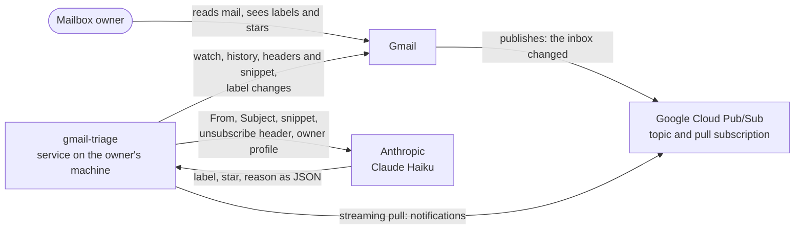
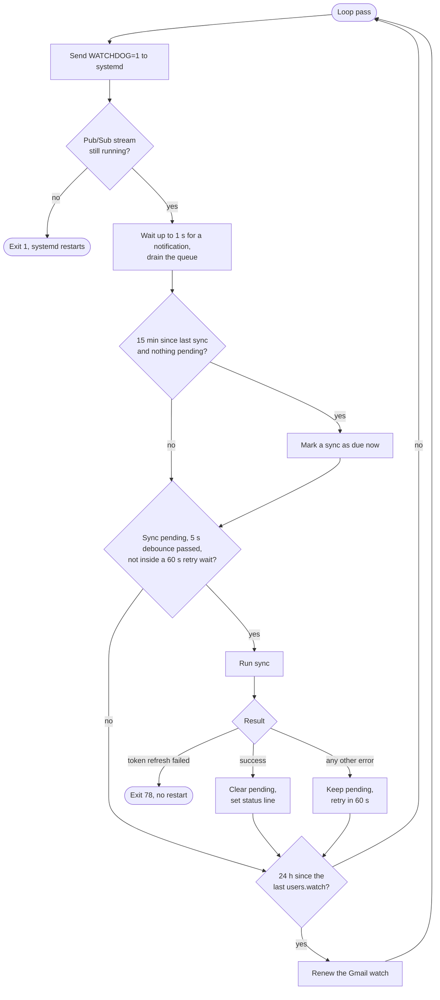
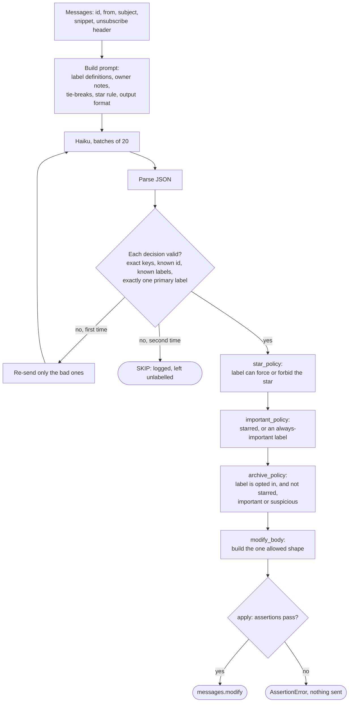

# gmail-triage — Architecture

How the system fits together: what runs, how a new message moves through it, and what each design decision gives and costs. Setup and day-to-day commands are in [README.md](README.md). The invariants the tests enforce are in [CLAUDE.md](CLAUDE.md).

Last checked against the code: 2026-10-09, commit 0b076d6.

## What it is

A background service for one Gmail mailbox. When a message lands in the inbox, it asks Claude Haiku which of 30 fixed labels fits, then adds the label, sets or clears the star, and sets or clears Gmail's importance marker. Three separate command-line tools back up the whole mailbox, report on it, and clean up old mail.

One sentence for the design: **the model only suggests a label; code decides everything that changes the mailbox, and the code can only make one narrow kind of change.**

## System context

Who talks to whom. The service makes outbound calls only. Nothing connects in to it.

What leaves the machine: for each message, the From and Subject headers, the List-Unsubscribe header and Gmail's snippet, plus the owner's profile text. The message body is never fetched (`messages.get` is called with `format=metadata`).

## Containers

What actually runs. It is one Python process under systemd, plus a short-lived `claude` child process per classifier call when the `cli` backend is used.

| Piece | What it is |
|---|---|
| systemd user service | Starts and restarts the process. `Type=notify`, watchdog 120 s |
| Python process (`python -m gmail_triage`) | The whole service |
| Main loop, one thread | Inside the process. Debounce, sync, watch renewal. Pings the watchdog about every second |
| Pub/Sub client threads | Inside the process. Their callback puts each notification on an in-memory queue and acks it. The main loop reads the queue |
| `claude -p` child process | One per classifier call, `cli` backend only. The `api` backend calls Anthropic directly instead |
| `state.json` | The `historyId` cursor |
| `logs/triage.log` | One line per message |
| `config/config.toml` | Settings, read at startup |
| `~/.config/gmail-triage` | Token, client secret, profile, API key |

Everything in the table is on the owner's Linux machine. Outside it are the Gmail API, Pub/Sub and Anthropic.

## Tech stack

| Layer | What | Notes |
|---|---|---|
| Language | Python 3.12+ | Standard library for config (`tomllib`), state, logging, subprocess |
| Gmail | `google-api-python-client` over `httplib2` | 30 s socket timeout; every call passes `num_retries=4` |
| Notifications | `google-cloud-pubsub` streaming pull | Pull, not push: no public endpoint |
| Auth to Google | OAuth installed-app flow, user credentials | Scopes `gmail.modify` and `pubsub`; the same token is used for Gmail and Pub/Sub |
| Classifier | Claude Haiku | `cli` backend: `claude -p` under the owner's Claude Code login. `api` backend: the `anthropic` SDK with an API key |
| Process supervision | systemd user service | `Type=notify`, `WatchdogSec=120`, `Restart=always`, exit 78 excluded |
| State | One JSON file | Written to a temp file, then `os.replace` |
| Cloud setup | `scripts/setup_gcloud.sh` (gcloud CLI) | Idempotent: project, billing link, APIs, budget, topic, subscription |
| Tests | pytest with an in-memory fake Gmail client | 83 test functions, 267 cases when run (2026-10-09). No network |
| Secret scanning | `.githooks/pre-commit` | Blocks commits containing known key and token shapes |

## Request flow: a new message arrives

This is the product.

1. Gmail publishes a notification to Pub/Sub: the inbox changed.
2. The streaming pull delivers it to the daemon, which acks it at once.
3. The daemon waits 5 s for more notifications.
4. It reads the saved `historyId` from `state.json`.
5. It asks Gmail for `history.list` since that id (`messageAdded`, `INBOX`). Gmail answers with the new message ids and the newest `historyId`.
6. It calls `messages.get` with `format=metadata` for each message.
7. It drops mail that is not in the inbox, is spam, trash or draft, or already has a triage label.
8. It sends Haiku the rules and profile, then up to 20 messages as JSON. Haiku answers with a JSON array of id, labels, star and reason.
9. It validates the answer, then settles star, important and archive in code.
10. It calls `messages.modify`, once per message.
11. It writes the newest `historyId` to `state.json`.

The notification is only a wake-up. It is acknowledged immediately and its content is not used. The saved `historyId` is the cursor: each sync asks Gmail for everything added to the inbox since that id, and the id moves forward only after the whole batch is processed.

What can go wrong, and what happens:

| Case | What happens |
|---|---|
| Model output is not valid for some messages | Those messages are sent again once. Still invalid: logged as `SKIP`, left unlabelled, and the cursor moves on |
| Classifier backend fails (CLI missing, not logged in, non-zero exit, timeout at 90 s, API error) | `ClassifierError`. The cursor does not move. The sync is retried after 60 s |
| A Gmail call fails after its 4 retries | Same: cursor stays, retry after 60 s. Messages already labelled are skipped on the retry because they now carry a triage label |
| A message was deleted between listing and fetching | Gmail answers 404 and the message is dropped from the batch |
| A notification is lost | A safety sweep runs the same sync every 15 minutes with no notification |
| Saved `historyId` is too old (Gmail answers 404) | Falls back to a search: `in:inbox newer_than:<gap>d has:nouserlabels`, where the gap is the days since the last successful sync plus one |
| OAuth token cannot be refreshed | Exit 78. systemd does not restart it; a person has to re-authorize |
| Bad `config.toml` or `profile.toml` | Exit 78 at startup |
| The Pub/Sub stream ends | Exit 1. systemd restarts it after 10 s, and startup runs a catch-up sync |
| The process hangs | No `WATCHDOG=1` for 120 s, so systemd kills and restarts it |
| Watch renewal fails | Logged, tried again in 10 minutes |

## The main loop

One thread runs everything. Each pass takes about a second, because the queue read has a one-second timeout.

Startup uses the same path: the loop begins with a sync already pending, so mail that arrived while the service was down is picked up about 5 seconds after start.

## The decision pipeline

From a batch of messages to the change sent to Gmail. The model's answer passes three gates before anything is written.

**Gate 1, validation** (`classifier.validate_decision`, `parse_output`). A decision must have exactly the keys `id`, `labels`, `star`, `reason`. The id must be one that was sent. Every label must be in the fixed list. There must be exactly one primary label; `Security › Suspicious` may stand alone or sit beside one primary. A missing or duplicated id counts as invalid.

**Gate 2, policy in code** (`star_policy`, `important_policy`, `archive_policy`). The model's `star` is only an input.

| Outcome | Rule |
|---|---|
| Star | Never for `Security › Suspicious` or any label in `NEVER_STAR` (14 labels: all Security, rejections, alerts, receipts, statements, orders, notifications, newsletters, promos). Always for `Jobs › Reply` and `Jobs › Interview`. Otherwise the model's `star` |
| Important | Never for suspicious mail. Yes if starred, or the label is `Jobs › Rejected` or `Personal`. The model has no say |
| Archive | Only if the label is listed in `daemon.archive_labels` (empty by default), and never for mail that is starred, important or suspicious |

**Gate 3, the write guard** (`gmail.modify_body`, `gmail.apply`). `apply` asserts the request before sending it:

- The body has only `addLabelIds` and, optionally, `removeLabelIds`.
- The only labels ever removed are `IMPORTANT` and `INBOX`.
- `IMPORTANT` is always either added or removed, never both and never neither.
- Nothing adds `TRASH`, `SPAM`, `UNREAD` or `INBOX`.
- `INBOX` is removed only when archiving is configured, and never on a message being starred or marked important.

So the daemon cannot delete mail, mark it read, unstar it or move it to spam, whatever the model returns.

### How the prompt is built

`classifier.build_rules` assembles it in a fixed order: the label list in three groups (Jobs, Money, Other) with one definition per label, the tie-break order, the star rule, then the output format. The messages follow as a JSON array.

The prompt in the repo is generic. An optional owner profile (`~/.config/gmail-triage/profile.toml`, outside the repo) holds a one-line description of the owner, general notes, and notes keyed by label name. Each note is inserted directly under the label it refines and the prompt says the note wins over the definition. A note for a name that is not a label stops startup with exit 78.

### The two backends

| | `cli` (default) | `api` |
|---|---|---|
| How | `claude -p` as a child process, prompt on stdin | `anthropic` SDK, `messages.create` |
| Auth | The Claude Code login already on the machine | `ANTHROPIC_API_KEY` from `~/.config/gmail-triage/.env` |
| Billing guard | `ANTHROPIC_API_KEY` and `ANTHROPIC_AUTH_TOKEN` are removed from the child's environment | n/a |
| Timeout | 90 s, then the child is killed. The watchdog is pinged every 5 s while waiting | 90 s, 2 SDK retries |
| Trimmed context | `--tools ""`, `--strict-mcp-config`, `--setting-sources ""`, `--disable-slash-commands`, `--no-session-persistence`, own `--system-prompt`; runs from a directory with no CLAUDE.md | Not needed |
| Thinking | Off (`MAX_THINKING_TOKENS=0`) | Not requested |

Measurements, both recorded as comments in `gmail_triage/classifier.py`, both dated 2026-09-28:

- The CLI flags cut a call's input from about 27.8k tokens to about 424.
- With extended thinking on, 20 real messages took 104 s and 8,124 thinking tokens. With it off, about 12 s and the same 20 labels.

## Command-line surface

There is no HTTP API. These are the entry points (`[project.scripts]` in `pyproject.toml`).

| Command | What it does | Changes Gmail? |
|---|---|---|
| `gmail-triage` | Run the daemon forever | Yes, within the write guard |
| `gmail-triage --once` | One catch-up sync from the saved cursor, then exit. No Pub/Sub | Yes |
| `gmail-triage --backfill 30d` | First triage untriaged inbox mail from the last N days, then continue | Yes |
| `gmail-triage --dry-run` | Log decisions only. No labels created, no modify calls, no `state.json` write | No |
| `gmail-triage-auth` | One-time OAuth flow on `localhost:8765`; saves the token with mode 600 | No |
| `gmail-triage-backup DEST` | Save every message as a raw `.eml` plus an index. `--query`, `--per-minute`, `--force` | No (read-only) |
| `gmail-triage-census DEST` | Read a backup and write `census.md` and `senders.csv`. Never calls Gmail | No |
| `gmail-triage-cleanup archive --older-than 30d [--mark-read] [--apply]` | Take old inbox mail out of the inbox. Starred mail stays | Only with `--apply` |
| `gmail-triage-cleanup trash BACKUP --senders FILE [--apply]` | Move delete candidates from approved senders to Trash | Only with `--apply` |
| `gmail-triage-cleanup restore FILE` | Undo one archive or trash run | Yes |

Gmail API methods used, and by what:

| Method | Used by | For |
|---|---|---|
| `users.watch` | daemon | Ask Gmail to publish inbox changes to the topic. Renewed every 24 h and at every start |
| `users.getProfile` | daemon | Current `historyId` on first run and after a history 404 |
| `users.history.list` | daemon | Message ids added to the inbox since the cursor |
| `users.messages.list` | daemon (backfill, fallback), backup, cleanup | Search by query |
| `users.messages.get` | daemon (`format=metadata`), backup (`format=raw`) | Headers and snippet, or the full raw message |
| `users.messages.modify` | daemon | The one write the daemon makes |
| `users.messages.batchModify` | cleanup | Bulk archive, mark read, trash and their reverses, 1,000 ids per call |
| `users.labels.list` / `create` | daemon, backup | Map label names to ids; create missing triage labels with their colour |

## How the runtime is used

There is no web framework. Specifics of how the process is put together:

- **One working thread.** The main loop does every Gmail call, classifier call and file write, one after another. Messages in a batch are modified one at a time.
- **The Pub/Sub library runs its own threads.** Its callback does two things: put the notification on a `queue.Queue` and ack it. All real work happens on the main thread, so there is no shared state to lock.
- **Debounce.** The first notification starts a 5-second timer. Everything that arrives in that window is drained and handled by one sync.
- **Watchdog pings are placed where the time goes.** Once per loop pass, once per fetched message, once per modified message, and every 5 s while waiting on the `claude` child process.
- **Exit codes carry meaning.** 78 means a person is needed (bad config, bad profile, missing or revoked token); the unit lists it in `RestartPreventExitStatus`. Any other exit is restarted after 10 s, with no start-rate limit (`StartLimitIntervalSec=0`).
- **Network calls are bounded.** `httplib2` gets a 30 s timeout (its default is none), and every Gmail call passes `num_retries=4` so the client library retries with backoff.
- **Dry run is enforced at each write point.** Labels are not created (missing ones map to a placeholder id), `apply` is not called, and `State` is built with `persist=False`.

## Data model

There is no database. These are the stores.

| Store | Where | Key and contents |
|---|---|---|
| Sync cursor | `state.json` in the checkout (gitignored) | `history_id` (last fully processed), `last_success` and `last_watch` timestamps |
| Triage labels on messages | Gmail itself | A message that already carries any of the 30 labels is skipped. This is what makes a repeated sync safe |
| Per-message log | `logs/triage.log` | Time, from, subject, labels, star, important, archived, the model's reason. Rotates at 2 MB, 5 files kept |
| Service log | systemd journal | Operational lines, token counts per classifier call |
| Config | `config/config.toml` (gitignored; `config.example.toml` is committed) | Cloud project and topic names, backend, model, batch size, timers, `archive_labels` |
| Owner profile | `~/.config/gmail-triage/profile.toml` | `owner`, `general`, `[notes]` keyed by label name |
| Secrets | `~/.config/gmail-triage/` | `token.json` (mode 600), `client_secret.json`, `.env` for the API backend |
| Backup | A directory the owner chooses | `messages/<last two id chars>/<id>.eml`, `index.jsonl` (one row per message), `labels.json`, `complete.json` |
| Restore files | `~/.config/gmail-triage/backups/` | One JSON per cleanup run: the action and the message ids it touched |

The label set is code, not data: `classifier.PRIMARY` (29 labels) plus `Security › Suspicious`. Names are flat. ` › ` is a naming convention only, because Gmail treats `/` as nesting.

## Backup, census and cleanup

Three tools for the mail that was already there before the daemon. They share the Gmail client and the OAuth token with the daemon but none of its write path.

How they chain together:

1. `gmail-triage-backup` (read-only) lists every message id, downloads each one raw, writes it as an `.eml`, then appends a row to `index.jsonl`.
2. `gmail-triage-census` (offline) reads that index and writes `census.md` and `senders.csv`.
3. The owner reads the report and puts the senders they approve into a file.
4. `gmail-triage-cleanup` builds a plan from the index and that file. Without `--apply` it only reports. With `--apply` it writes the restore file first, then changes Gmail with `batchModify`, 1,000 ids a call.

**Backup.** Four worker threads, each with its own Gmail client because `httplib2` connections are not thread-safe. A shared `Pacer` spaces the calls so the total stays at 120 a minute. A 403 or 429 is waited out (30 s, up to 10 times) instead of failing. A message counts as done only when its row is in `index.jsonl`, and the row is written after the `.eml` is on disk, so re-running the command fetches only what is missing. `complete.json` is deleted at the start of a run and written last.

The 120 figure is a measurement, recorded in `gmail_triage/backup.py`: Gmail's quota page implies 300 raw downloads a minute, but on 2026-10-08 it returned `rateLimitExceeded` from about 130.

**Census.** Reads only the backup directory. `census.keep_reasons` is the whole definition of a delete candidate: a message is a candidate only when none of these seven reasons to keep it applies.

| Reason | Kept when |
|---|---|
| yours | It is in Sent or Drafts |
| not bulk | It has no List-Unsubscribe header |
| category | It is not in Gmail's Promotions or Social category |
| document | It has a named attachment that is not an image |
| replied | The owner wrote in the same thread |
| starred | It is starred |
| labelled | It has a user label other than `Promos` or the `Newsletters` family |

The report also runs a star check: starred messages that every other rule would delete, listed for the owner to judge.

**Cleanup.** The only code that archives in bulk, marks read or trashes. Every request body it can send is one of six constants (`cleanup.ALLOWED`), and `batch_modify` asserts that. Trash applies only to candidates whose sender is in the owner's approved file, and it checks the live starred set, so a star added after the backup still protects a message. Without `--apply` it reports. With it, the restore file is written before the first change.

## Deployment

There is no build, image or pipeline. The service runs straight from a git checkout on the owner's machine.

One time:

1. `setup_gcloud.sh` creates the project, APIs, budget, topic and pull subscription.
2. Create an OAuth client in the Cloud Console, then run `gmail-triage-auth`.
3. Do a dry run with backfill and read `triage.log`.
4. `install_service.sh` writes the unit file.
5. `systemctl --user enable --now` starts the service.

Every change:

1. Edit and commit.
2. Run pytest (267 cases).
3. `systemctl --user restart`.

- The unit runs `.venv/bin/python -m gmail_triage` from the checkout, with an editable install. The running code is whatever is checked out when the service starts.
- `install_service.sh` fills the checkout path into `systemd/gmail-triage.service.in` and writes the unit to the user's systemd directory.
- Config and profile are read once at startup. Changing either needs a restart.
- The test gate is local. There is no CI.
- Going back means checking out an earlier commit and restarting. `state.json` is unaffected.

## Key decisions and their cost

| Decision | What it gives | What it costs |
|---|---|---|
| Pub/Sub pull subscription, not a push webhook | No public endpoint; works behind any NAT | A long-running process, and a Google Cloud project with billing linked |
| The notification carries no state; `historyId` is the cursor | Lost, duplicated or late notifications do no harm. Catch-up after downtime is the same code as normal operation | One `history.list` per wake-up even when nothing relevant changed |
| Cursor moves only after the whole batch | A failure never loses mail | A failed batch is re-read from the start (already-labelled messages are skipped) |
| Headers and snippet only, never the body | Little mail content leaves the machine; small prompts | The model judges from the sender, subject and a short snippet |
| Fixed label list in code | Output can be validated exactly; tests can cover every label | Changing a label means editing code, colours and tests |
| Stars, importance and archiving decided in code | The model cannot star a login alert or archive something starred | Rules are per label, so they are blunt |
| Never guess: retry once, then skip | No message gets a label the model did not validly give | A skipped message stays unlabelled until a backfill |
| The write guard in `apply` | The worst a bad model answer or a bug can do is a wrong label | Any new kind of change needs the assertions and tests edited first |
| Daemon owns `IMPORTANT` both ways | Importance means one thing: starred or an always-important label | Gmail's own importance signal is discarded on triaged mail |
| Archiving is opt-in per label | Default install never takes mail out of the inbox | The owner has to configure it |
| Generic prompt in the repo, owner profile outside it | The repo is publishable; tuning needs no code change | Two places define behaviour; a profile is needed for `Jobs › Skip` and `Business` to be used at all |
| `claude -p` as the default backend | Runs under an existing Claude Code login with no API key | A process start per call; depends on CLI flags that can change (README, "Classifier backends") |
| Thinking off | About 12 s instead of 104 s on 20 messages, same labels (2026-09-28) | None measured |
| One process, one thread, one mailbox | Nothing to lock; easy to reason about | Throughput is one classifier call at a time |
| State in one JSON file | No database to run or back up | Fits exactly one mailbox per checkout |
| Exit 78 for "a person is needed" | No restart loop on a revoked token or bad config | The service stays down until someone looks |
| Backup paced at the measured limit | The running daemon keeps its share of the quota | A large mailbox takes hours |
| Cleanup needs `--apply`, an approved-senders file and writes a restore file first | Three deliberate steps before anything is trashed | Slower than a one-line purge |

## Known limits

- **One mailbox.** Token, state and config are single files with no account key.
- **A skipped message is not retried.** The cursor moves past it. Only `--backfill` picks it up again.
- **Mail that never reaches the inbox is never triaged.** The watch, the history query and `needs_triage` all require `INBOX`.
- **The history fallback uses `has:nouserlabels`.** After a long outage, mail that carries any user label, not only a triage label, is skipped.
- **The first run starts from "now".** Older mail is untouched unless `--backfill` is used.
- **Label colours are set only when a label is created.** An existing label with the same name is reused as it is.
- **The label set suits one person.** It is fixed in code; a different set means a fork.
- **The `api` backend has had far less real use than `cli`** (README).
- **The backup is a copy, not a restore tool.** Nothing re-imports `.eml` files into Gmail.
- **Tests use a fake Gmail client.** They check the logic and the write guard, not Gmail's real behaviour.
- **No CI.** The test gate is whoever runs pytest before restarting.

## If it had to grow (not built)

None of this exists today.

1. More than one mailbox: token, state and profile keyed by account, and one watch per account.
2. A retry list for skipped messages, so they do not wait for a backfill.
3. A label set loaded from config instead of code, with the star and importance rules alongside it.
4. Higher volume: classify batches concurrently, which means the single-thread assumptions go.
